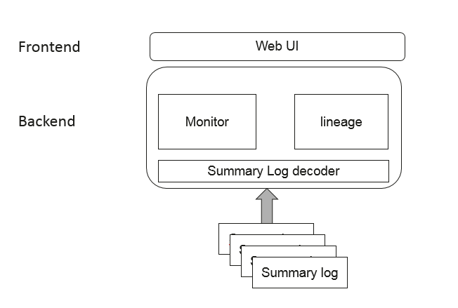

# MindInsight

<!-- TOC -->

- [Introduction](#introduction)
- [Installation](#installation)
    - [System Environment Information Confirmation](#system-environment-information-confirmation)
    - [Installation Methods](#installation-methods)
        - [Installation by pip](#installation-by-pip)
        - [Installation by Source Code](#installation-by-source-code)
            - [Downloading Source Code from Gitee](#downloading-source-code-from-gitee)
            - [Compiling MindInsight](#compiling-mindInsight)
    - [Installation Verification](#installation-verification)
- [Quick Start](#quick-start)
- [Docs](#docs)
- [Community](#community)
    - [Governance](#governance)
    - [Communication](#communication)
- [Vulkan Vision](#vulkan-vision)
- [Contributing](#contributing)
- [Release Notes](#release-notes)
- [License](#license)

<!-- /TOC -->

[简体中文](./README_CN.md)

## Introduction

MindInsight provides MindSpore with easy-to-use debugging and tuning capabilities. During the training, data such as scalar, tensor, image, computational graph, model hyper parameter and training’s execution time can be recorded in the file for viewing and analysis through the visual page of MindInsight.



Click to view the [MindInsight design document](https://www.mindspore.cn/mindinsight/docs/en/r1.8/training_visual_design.html), learn more about the design.
Click to view the [Tutorial documentation](https://www.mindspore.cn/mindinsight/docs/en/r1.8/index.html) learn more about the MindInsight tutorial.

## Installation

### System Environment Information Confirmation

- The hardware platform supports Ascend, GPU and CPU.
- Confirm that [Python](https://www.python.org/ftp/python/3.7.5/Python-3.7.5.tgz) 3.7.5 is installed.
- The versions of MindInsight and MindSpore must be consistent.
- If you use source code to compile and install, the following dependencies also need to be installed:
    - Confirm that [node.js](https://nodejs.org/en/download/) 10.19.0 or later is installed.
    - Confirm that [wheel](https://pypi.org/project/wheel/) 0.32.0 or later is installed.
- All other dependencies are included in [requirements.txt](https://gitee.com/mindspore/mindinsight/blob/r1.8/requirements.txt).

### Installation Methods

You can install MindInsight either by pip or by source code.

#### Installation by pip

Install from PyPI:

```bash
pip install mindinsight
```

Install with customized version:

```bash
pip install https://ms-release.obs.cn-north-4.myhuaweicloud.com/{version}/MindInsight/any/mindinsight-{version}-py3-none-any.whl --trusted-host ms-release.obs.cn-north-4.myhuaweicloud.com -i https://pypi.tuna.tsinghua.edu.cn/simple
```

> - When the network is connected, dependency items are automatically downloaded during .whl package installation. (For details about other dependency items, see [requirements.txt](https://gitee.com/mindspore/mindinsight/blob/r1.8/requirements.txt)). In other cases, you need to manually install dependency items.
> - `{version}` denotes the version of MindInsight. For example, when you are downloading MindSpore 1.3.0, `{version}` should be 1.3.0.
> - MindInsight supports only Linux distro with x86 architecture 64-bit or ARM architecture 64-bit.

#### Installation by Source Code

##### Downloading Source Code from Gitee

```bash
git clone https://gitee.com/mindspore/mindinsight.git
```

##### Compiling MindInsight

You can choose any of the following installation methods:

1. Run the following command in the root directory of the source code:

    ```bash
    cd mindinsight
    pip install -r requirements.txt -i https://pypi.tuna.tsinghua.edu.cn/simple
    python setup.py install
    ```

2. Build the `whl` package for installation.

    Enter the root directory of the source code, first execute the MindInsight compilation script in the `build` directory, and then execute the command to install the `whl` package generated in the `output` directory.

    ```bash
    cd mindinsight
    bash build/build.sh
    pip install output/mindinsight-{version}-py3-none-any.whl -i https://pypi.tuna.tsinghua.edu.cn/simple
    ```

### Installation Verification

Execute the following command:

```bash
mindinsight start [--port PORT]
```

*notes: the param --port default value is 8080*

If it prompts the following information, the installation is successful:

```bash
Web address: http://127.0.0.1:8080
service start state: success
```

## Quick Start

Before using MindInsight, the data in the training process should be recorded. When starting MindInsight, the directory of the saved data should be specified. After successful startup, the data can be viewed through the web page. Here is a brief introduction to recording training data, as well as starting and stopping MindInsight.

[SummaryCollector](https://www.mindspore.cn/docs/en/r1.8/api_python/mindspore/mindspore.SummaryCollector.html#mindspore.SummaryCollector) is the interface MindSpore provides for a quick and easy collection of common data about computational graphs, loss values, learning rates, parameter weights, and so on. Below is an example of using `SummaryCollector` for data collection, specifying the directory where the data is stored in `./summary_dir`.

```python
...

from mindspore import SummaryCollector
summary_collector = SummaryCollector(summary_dir='./summary_dir')
model.train(epoch=1, ds_train, callbacks=[summary_collector])
```

For more ways to record visual data, see the [MindInsight Tutorial](https://www.mindspore.cn/mindinsight/docs/en/r1.8/index.html).

After you've collected the data, when you launch MindInsight, specify the directory in which the data has been stored.

```bash
mindinsight start --summary-base-dir ./summary_dir [--port PORT]
```

*notes: the param --port default value is 8080*

After successful startup, visit `http://127.0.0.1:8080` through the browser to view the web page.

Command of stopping the MindInsight service:

```bash
mindinsight stop [--port PORT]
```

*notes: the param --port default value is 8080, you can stop the specified port MI service.*

For more about MindInsight command_line，see the [MindInsight Command_line](https://www.mindspore.cn/mindinsight/docs/en/r1.5/index.html).

## Docs

More details about installation guide, tutorials and APIs, please see the
[User Documentation](https://gitee.com/mindspore/docs).

## Community

### Governance

Check out how MindSpore Open Governance [works](https://gitee.com/mindspore/community/blob/master/governance.md).

### Communication

- [MindSpore Slack](https://join.slack.com/t/mindspore/shared_invite/zt-dgk65rli-3ex4xvS4wHX7UDmsQmfu8w) - Communication platform for developers.
- IRC channel at `#mindspore` (only for meeting minutes logging purpose)
- Video Conferencing: TBD
- Mailing-list: <https://mailweb.mindspore.cn/postorius/lists>

## Vulkan Vision

Vulkan Vision(V-Vision) provides an unprecedented level of detail into the execution of Vulkan applications through dynamic instrumentation. V-Vision supports analyzing AI workloads implemented using the a compute pipeline as well as traditional raster and ray-tracing Vulkan applications. To use V-Vision please refer to the [build instructions](https://gitee.com/mindspore/mindinsight/blob/r1.8/ecosystem_tools/VulkanVision/README.md). For more information, please refer to [the paper](https://webdocs.cs.ualberta.ca/~amaral/papers/PankratzCGO21) published at CGO 2021.

## Contributing

Welcome contributions. See our [Contributor Wiki](https://gitee.com/mindspore/mindspore/blob/master/CONTRIBUTING.md) for more details.

## Release Notes

The release notes, see our [RELEASE](RELEASE.md).

## License

[Apache License 2.0](LICENSE)
